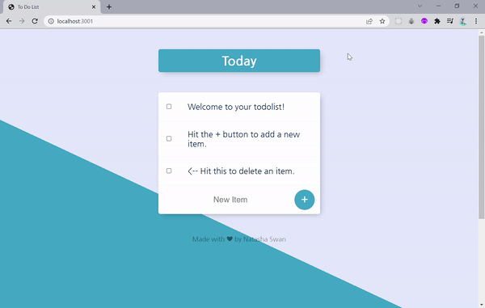

# To-Do List and Node.js

> Individual Project for App Brewery Bootcamp. A to-do list app where you can add and delete items. 

### Topics covered: 
- Node.js and its modules,
- EJS templating,
- routing, passing data between server and webpage,
- saving data to a database,
- rendering database items,
- website deployment.
  
### Status: inactive, complete

---
## Technologies used
1. Node.js
2. EJS
3. Nodemon
4. Mongo DB, Atlas
5. Mongoose
6. NPM
7. HTML+CSS
---
## App Screenshot

 
   

